<!-- layout: cover -->
# Similitudes y conexiones entre papers

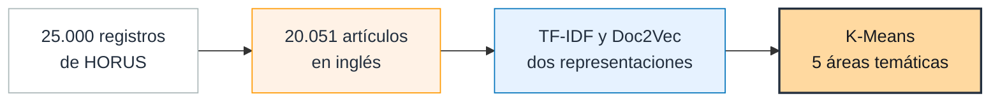

Notas: Presentamos cómo pasamos de un export bibliográfico de 25.000 registros a un corpus limpio en inglés, y de ahí a dos representaciones vectoriales que permiten medir similitud y agrupar artículos.

---

<!-- section: Introducción -->
<!-- item: El proyecto en una mirada -->
# El pipeline del proyecto: esta entrega prepara el texto que alimentan RAG y KAG
## En naranja, lo que cubre esta entrega; en blanco, la fase siguiente

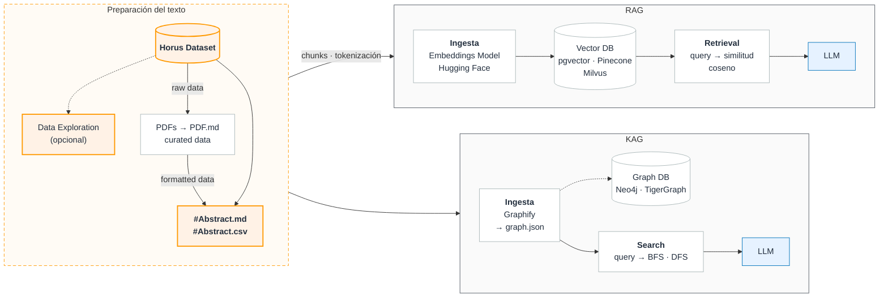

Notas: Este es el pipeline completo del equipo. Esta entrega cubre el dataset de HORUS, su exploración, los abstracts limpios y su tokenización; TF-IDF, Doc2Vec y K-Means (sección 3) son las representaciones base con las que entendemos el corpus antes de pasar a embeddings. RAG y KAG son la fase siguiente.

---

<!-- layout: agenda -->
<!-- section: Introducción -->
<!-- item: Agenda -->
# Agenda: los puntos de la entrega
## Cada punto del enunciado con la diapositiva donde se responde

Notas: La presentación sigue el orden del enunciado. Al final están los hallazgos, los entregables y un anexo para preguntas.

---

<!-- section: 1 · Entendimiento del negocio -->
<!-- item: 1.1 · Objetivo del negocio y del proyecto -->
# Objetivo: que la producción académica se pueda conectar por su contenido
## Del problema al objetivo del proyecto

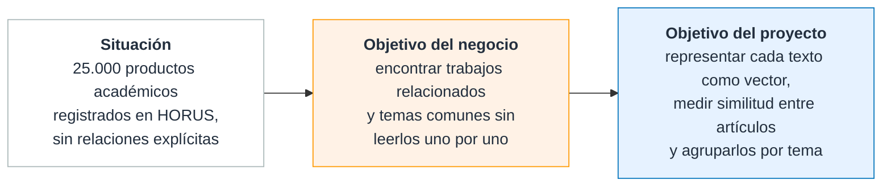

> **Pregunta de investigación:** ¿cómo se comparan la recuperación con embeddings (RAG) y con grafos de conocimiento (KAG) para encontrar y explicar relaciones entre artículos?

Notas: El negocio es la universidad y sus investigadores: hoy la producción está registrada pero no conectada. Esta entrega construye la base: el corpus limpio y sus representaciones.

---

<!-- section: 1 · Entendimiento del negocio -->
<!-- item: 1.2 · Descripción del conjunto de textos seleccionado -->
# 25.000 registros bibliográficos; para NLP usamos el título y el abstract
## Qué trae cada registro y de qué fuente viene

::: kpi
25.000 | registros
13 | columnas por registro
jul. 2021 – dic. 2025 | fechas de publicación
11 | fuentes bibliográficas
:::

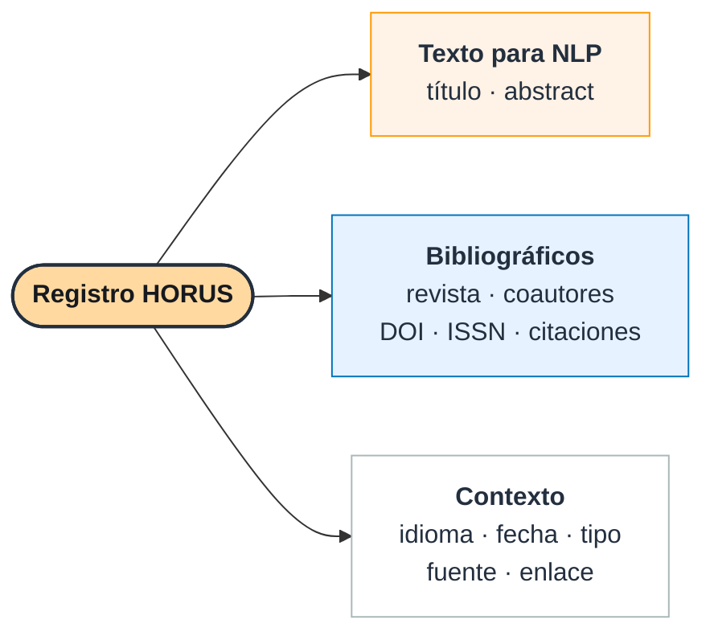

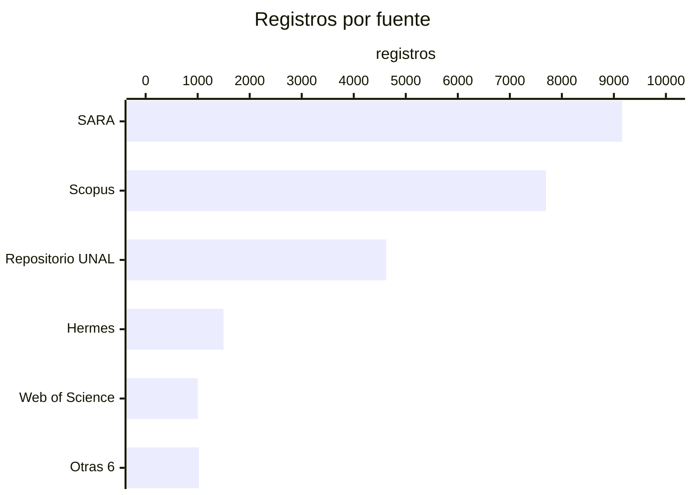

Notas: Los metadatos sirven para describir el corpus y, más adelante, para el grafo (coautores, revista). El texto que se modela es título más abstract.

---

<!-- section: 1 · Entendimiento del negocio -->
<!-- item: 1.3 · Proceso de carga u obtención de textos -->
# La mitad estaba en español: el texto se tradujo al inglés antes de entrar al pipeline
## Cómo llegan los textos al notebook

::: kpi
49 % | en inglés en el original
48 % | en español
3 % | otros idiomas o sin dato
:::

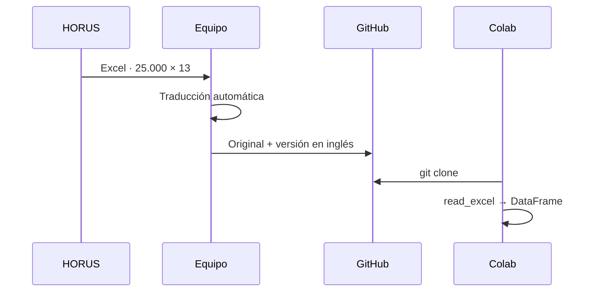

> **Riesgo:** la calidad de la traducción no se ha medido. Hay evidencia de errores (anexo A2).

Notas: Sin un solo idioma, TF-IDF no puede comparar un artículo en español con uno en inglés: por eso se tradujo. Es la decisión con más riesgo del pipeline; en el anexo A2 están los problemas que encontramos.

---

<!-- section: 2 · Entendimiento y preparación del conjunto de texto -->
<!-- item: 2.1 · Análisis exploratorio del conjunto de textos -->
# El faltante real de abstracts es 17 %, no 6 %
## Nulos por columna (izquierda) y abstracts que parecen llenos pero no lo están (derecha)

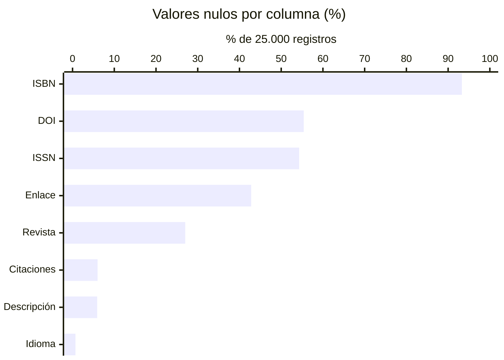

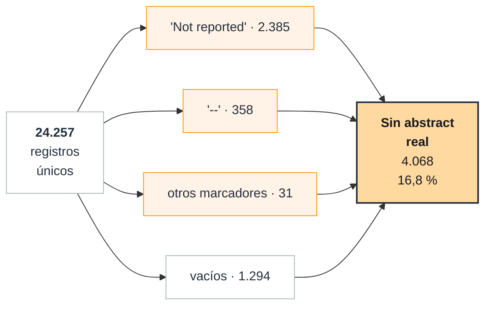

Notas: El conteo de nulos dice que falta el 6 % de las descripciones. Pero 2 de cada 3 abstracts "vacíos" tienen texto de relleno como 'Not reported' o '--'. Además, el 85 % de los registros de Web of Science no trae abstract. Título, coautores, fecha, tipo y fuente están completos.

---

<!-- section: 2 · Entendimiento y preparación del conjunto de texto -->
<!-- item: 2.2 · Análisis descriptivo -->
# Casi la mitad son artículos de revista, con abstracts de unas 190 palabras
## Composición y longitud de los 20.051 artículos del corpus final

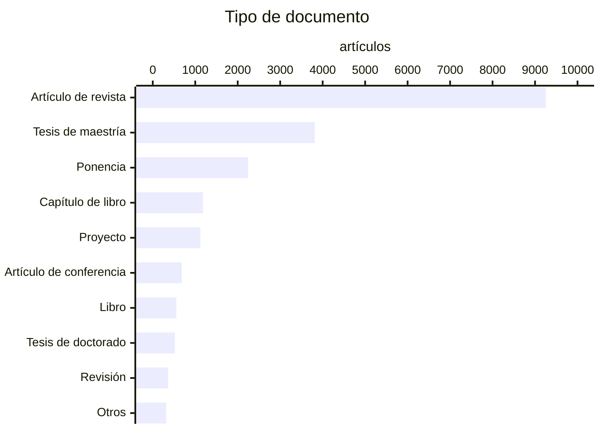

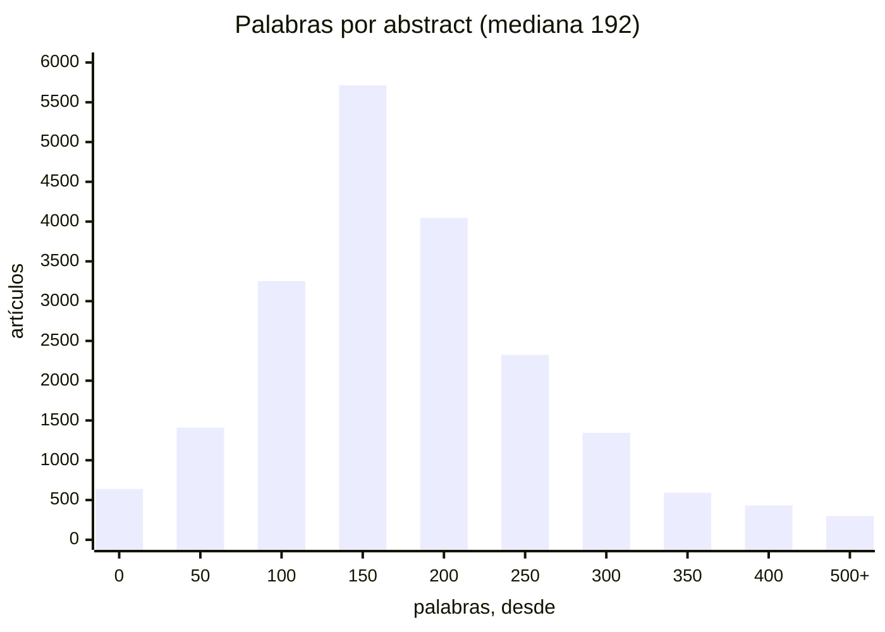

Notas: Tesis, ponencias y capítulos tienen estilos y longitudes distintos a los artículos de revista; eso se nota luego en la similitud. Todas las tesis vienen del Repositorio UNAL. La mitad de los abstracts tiene entre 146 y 249 palabras.

---

<!-- section: 2 · Entendimiento y preparación del conjunto de texto -->
<!-- item: 2.3 · Visualización de los textos -->
# El vocabulario más común es genérico: ningún término está en más de un tercio del corpus
## Términos más frecuentes tras el preprocesamiento, y un texto antes y después

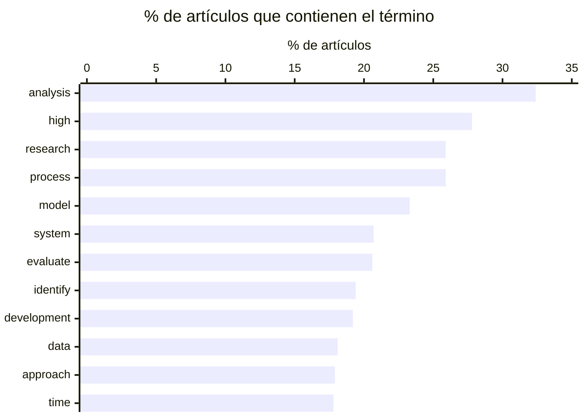

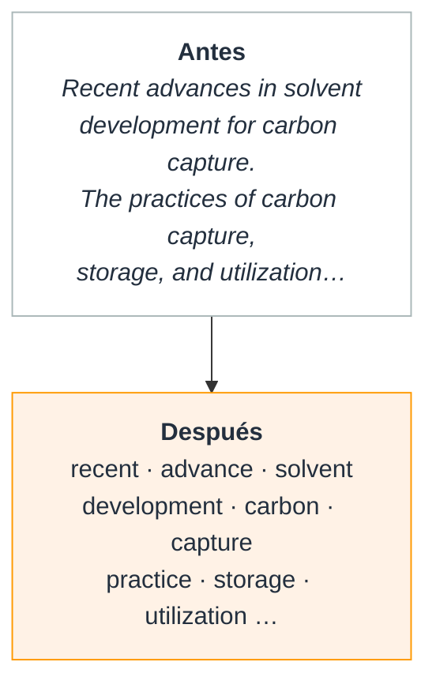

Notas: Por eso TF-IDF, que penaliza lo común, es el punto de partida natural. 'colombia' y 'colombian' aparecían entre los primeros (todo el corpus es de la UNAL) y se añadieron a las stopwords de dominio.

---

<!-- section: 2 · Entendimiento y preparación del conjunto de texto -->
<!-- item: 2.4 · Preprocesamiento en NLP (pipeline seguido) -->
# De 25.000 registros quedan 20.051 artículos únicos, con abstract y en inglés
## Depuración del corpus: cada registro eliminado queda en un CSV con su motivo

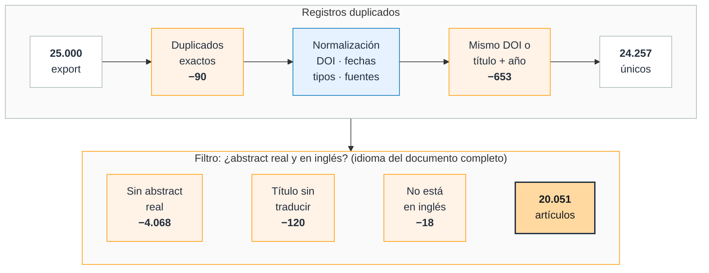

Notas: Se conserva el 80 % del export. El duplicado por DOI es el más común porque un artículo se indexa en varias bases (sobre todo Scopus y SARA); se conserva el registro con abstract. El idioma se decide con título más abstract, no solo con el título (anexo A3). El Excel original no se modifica.

---

<!-- section: 2 · Entendimiento y preparación del conjunto de texto -->
<!-- item: 2.4 · Preprocesamiento en NLP (pipeline seguido) -->
# Cada texto pasa por cuatro pasos hasta quedar como tokens lematizados
## Mediana por documento: 192 palabras de entrada → 105 tokens

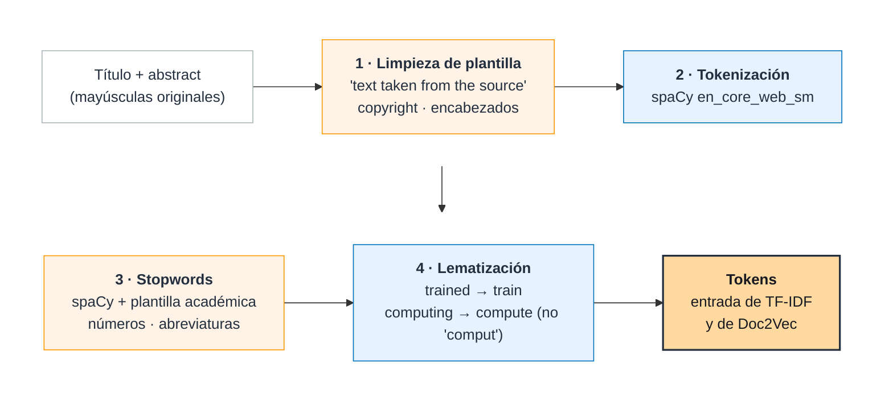

Notas: Lematización y no stemming: el stemming deja raíces ilegibles (comput) y los términos de TF-IDF y los nodos del grafo deben poder leerse. La limpieza de plantilla importa: '(text taken from the source)' estaba en unos 1.300 registros del Repositorio UNAL y habría hecho parecer similares a todos esos documentos.

---

<!-- section: 3 · Transformación del texto para extracción de características -->
<!-- item: 3.1 · Estrategia de extracción de características -->
# Dos representaciones del mismo texto, sometidas al mismo procedimiento
## Mismos tokens de entrada; a cada una se le calculan vecinos y se le aplica K-Means para comparar

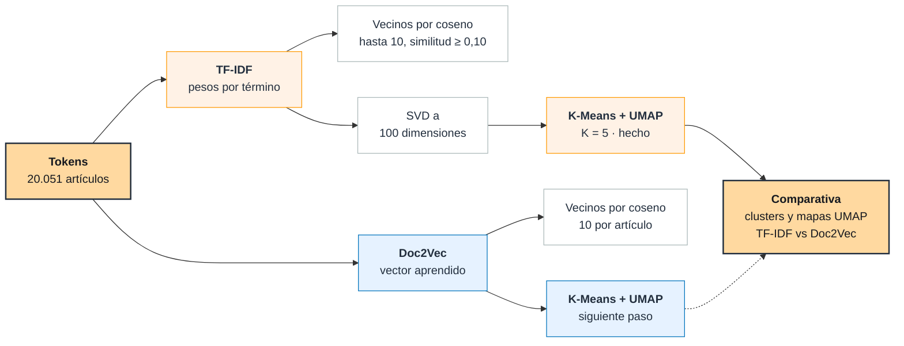

Notas: No elegimos una representación a priori: las dos pasan por el mismo procedimiento y se comparan con los mismos criterios. TF-IDF se reduce con SVD antes de K-Means porque es dispersa y de 25.071 columnas; Doc2Vec ya tiene 100 dimensiones. K-Means y UMAP sobre Doc2Vec son el siguiente paso, para la comparativa.

---

<!-- section: 3 · Transformación del texto para extracción de características -->
<!-- item: 3.2 · Representaciones: cómo se ven las matrices -->
# TF-IDF da una matriz enorme y casi vacía; Doc2Vec, una pequeña y llena
## Los mismos 12 artículos (3 por tema) en las dos matrices · color intenso = peso alto · en Doc2Vec, azul = valor negativo


Notas: En TF-IDF cada columna es un término del vocabulario (25.071) y casi todas las celdas son cero: en promedio un artículo usa unos 70 términos distintos, el 0,28 % de las columnas. En Doc2Vec cada columna es una dimensión aprendida (100) y todas las celdas tienen valor: no se pueden leer como palabras.

---

<!-- section: 3 · Transformación del texto para extracción de características -->
<!-- item: 3.3 · TF-IDF -->
# TF-IDF conecta artículos por vocabulario técnico compartido, y puede explicar cada conexión
## Los 4 vecinos más cercanos de un artículo; en cada flecha, la similitud y los términos que más aportan

```mermaid
{{NEIGHBORS_TFIDF}}
```

> Las similitudes son bajas en valor absoluto (≈ 0,2): lo que importa es el orden de los vecinos, no el número.

Notas: Artículo HORUS_000037. Los cuatro vecinos tratan de control de bacterias que atacan cultivos, y los términos que los unen son nombres de especies y del método (carotovorum, pectobacterium, solanacearum, bacillus). Es lo que TF-IDF hace bien: unir por vocabulario técnico poco frecuente. El quinto vecino (0,18) ya es de biopelículas orales: las conexiones más débiles se apoyan en palabras más generales. Su límite: no ve sinónimos; para TF-IDF, 'crop' y 'cultivation' no tienen relación.

---

<!-- section: 3 · Transformación del texto para extracción de características -->
<!-- item: 3.4 · Doc2Vec -->
# Doc2Vec aprende relaciones entre palabras que TF-IDF no ve
## Palabras más cercanas a cuatro términos del corpus, según el modelo (similitud coseno)

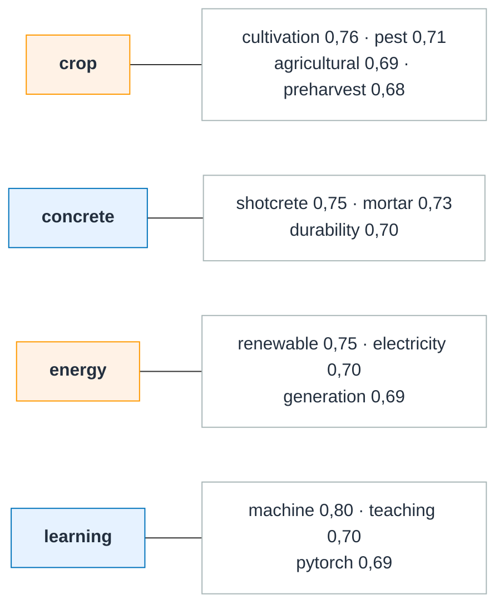

> **Límite:** sus 100 dimensiones no son palabras; para explicar por qué conecta dos artículos hay que volver a TF-IDF.

Notas: Variante PV-DBOW con vectores de palabra. Los términos raros (siglas o erratas de 3-4 artículos) generan vecinos ruidosos. Los parámetros están en el anexo A1.

---

<!-- layout: figure -->
<!-- section: 3 · Transformación del texto para extracción de características -->
<!-- item: 3.5 · Agrupamiento con K-Means -->
# K-Means sobre TF-IDF encuentra cinco áreas amplias, con fronteras difusas
## Artículos proyectados en 2D con UMAP y coloreados por cluster (K = 5)


::: leyenda
#0173B2 | Ciencias sociales y educación · 6.382
#DE8F05 | Modelado y simulación · 4.600
#029E73 | Química y materiales · 3.843
#D55E00 | Salud y clínica · 2.851
#CC78BC | Biodiversidad y ecología · 2.375
:::

::: kpi
0,05 | silueta: clusters poco separados
0,80 | ARI entre corridas: K = 5 es estable, no necesariamente bueno
:::

Notas: K de 2 a 10 con 100 corridas por K; K = 5 fue el más estable entre 3 y 10 y dio temas interpretables. Pero la silueta de 0,05 dice que los grupos están poco separados: son temas amplios con fronteras difusas, no categorías cerradas. t-SNE muestra las mismas regiones. Siguiente paso: el mismo mapa y K-Means sobre Doc2Vec, para compararlos.

---

<!-- layout: cards -->
<!-- section: Cierre -->
<!-- item: Hallazgos -->
# Lo que sabemos hasta ahora

::: cards
El corpus pedía más limpieza de la que se veía | 17 % sin abstract real, 743 duplicados y la mitad en español: quedan 20.051 de 25.000 registros.
Las dos representaciones se complementan | TF-IDF explica cada conexión pero no ve sinónimos; Doc2Vec capta relaciones de significado pero no las explica.
Hay estructura temática, pero poco separada | Cinco áreas amplias con silueta de 0,05. Siguiente: compararlas con K-Means y UMAP sobre Doc2Vec.
:::

Notas: Tres ideas para llevarse. La tercera es también la principal limitación: sin etiquetas de qué artículos son similares, ninguna representación se puede declarar mejor.

---

<!-- section: Cierre -->
<!-- item: Entregables y próximos pasos -->
# Entregables y lo que sigue
## Siguiente paso: comparar UMAP y K-Means de TF-IDF contra los de Doc2Vec

::: cards
Notebook de trabajo | NPL_Proyecto.ipynb en Google Colab: de la carga a K-Means, reproducible desde el repositorio.
Datasets | Excel original y traducido (25.000 registros); corpus limpio, tokens, matrices, vecinos, clusters y registros descartados con su motivo.
Documento | Artículo en formato científico con el método y los resultados.
:::

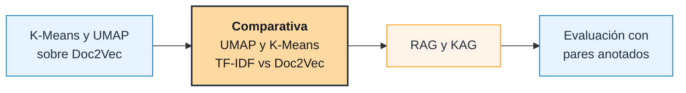

Notas: Todo está en el repositorio mbarrerag/NLP-Project; las salidas del notebook se regeneran ejecutándolo. Siguiente paso: K-Means y UMAP sobre Doc2Vec con los mismos parámetros que TF-IDF (K = 5, mismos vecinos y semilla de UMAP) y comparar: tabla cruzada de clusters, ARI/NMI entre las dos particiones y los dos mapas lado a lado. La silueta no se compara directo entre espacios distintos y UMAP deforma distancias globales: el mapa sirve para ver, no para medir. El reto abierto es la evaluación: no existen etiquetas de qué artículos son similares, así que hay que construirlas.

---

<!-- layout: closing -->
<!-- section: Cierre -->
<!-- item: Preguntas -->
# ¿Preguntas?

Notas: En el anexo hay respaldo para las preguntas más probables: parámetros (A1), traducción (A2) e idioma (A3).

---

<!-- layout: table -->
<!-- section: Anexo -->
<!-- item: A1 · Parámetros y decisiones -->
# Parámetros de las representaciones y por qué se eligieron

| | TF-IDF | Doc2Vec | K-Means |
|---|---|---|---|
| Configuración | unigramas · min_df 3 · max_df 0,8 · sublinear_tf | PV-DBOW (dm 0, dbow_words 1) · 100 dimensiones · window 5 · min_count 3 · 40 épocas | K de 2 a 10 · 100 corridas por K · SVD a 100 dimensiones para TF-IDF |
| Por qué | los bigramas multiplican el vocabulario ×6 y el vecino más cercano se mantiene en el 95 % de los casos | PV-DBOW funciona mejor en textos cortos; vectores de palabra para inspeccionar el modelo | K = 5: el más estable entre 3 y 10 (ARI 0,80) y con temas interpretables |
| Resultado | 25.071 términos · densidad 0,28 % · 200.041 pares con similitud ≥ 0,10 | 32.947 palabras · 200.510 pares (no se filtra ninguno) | silueta 0,051 · Davies-Bouldin 3,94 |

Notas: Diferencia entre 200.041 y 200.510 pares: TF-IDF descarta los vecinos con similitud menor a 0,10 (469 pares); en Doc2Vec ninguno queda por debajo. 105 tokens por documento cuenta repeticiones; 70 términos por artículo cuenta términos distintos dentro del vocabulario de TF-IDF.

---

<!-- layout: cards -->
<!-- section: Anexo -->
<!-- item: A2 · Calidad de la traducción -->
# La traducción automática dejó errores que el pipeline detecta, pero no corrige
## Evidencia encontrada en la versión en inglés del dataset

::: cards
120 títulos sin traducir | Abstract en inglés y título en español: se eliminan en el filtro de idioma.
35 registros con marcas internas | Restos como '__KEEP0_' donde la traducción perdió contenido (≤, URLs, cursivas). Se limpian, pero el texto perdido no vuelve.
Títulos en MAYÚSCULAS mal traducidos | Ej.: 'AEROSOLES GONE BY VEEGETATION SCHEDULE' (original: aerosoles generados por quemas de vegetación).
:::

> **Pendiente:** documentar la herramienta de traducción y revisar a mano una muestra.

Notas: La traducción unifica el idioma, que es lo que TF-IDF necesita, pero introduce ruido. No hemos medido su calidad; la evidencia es cualitativa.

---

<!-- section: Anexo -->
<!-- item: A3 · Decisiones del preprocesamiento -->
# El idioma se decide con todo el documento, no solo con el título
## Y se lematiza en vez de hacer stemming

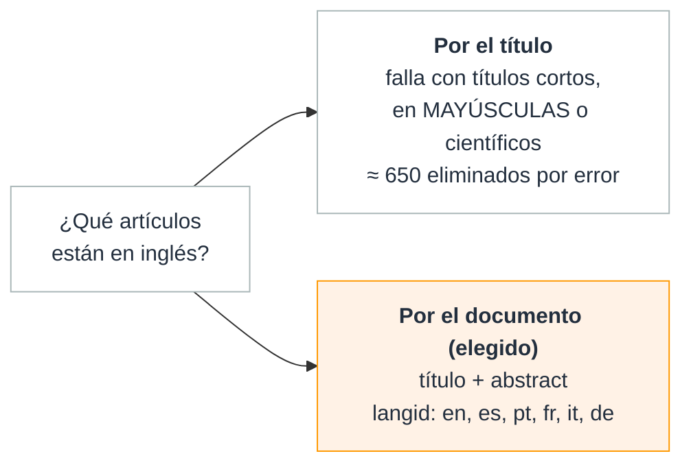

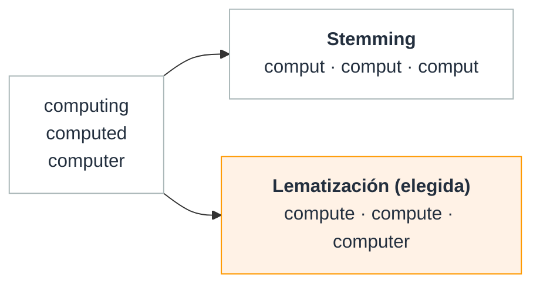

Notas: Ejemplos reales de langid sobre títulos: 'STAPHYLOCOCCUS AUREUS IN PEDIATRIA' sale italiano y 'Observation of the B0 → D̄*0K+π- decays' sale latín. Con título y abstract juntos, 20.711 de 20.741 documentos con abstract salen en inglés.
